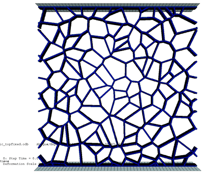

# vorokite

**vorokite** is the public, open-source core for generating lightweight Voronoi-style lattice structures with periodic boundary condition (PBC).

> **Note:** The Abaqus-based automated meshing and simulation setup for  in solid element (**.inp export, ODB reading, runners**) is **not** included in this public version. Access to that private add-on is available **upon request** for collaborators or licensing.

  

---

## What’s inside (public core)

- **Voronoi lattice generator (PBC)** from user-specified centers.
- **Finite Voronoi region reconstruction** and clipping to the unit square \[0,1\]².
- **Geometry export** to CSV (`nodes.csv`, `edges.csv`) or NPY for downstream tooling.
- **Stochasticity metrics**:
  - variance of neighbors per cell
  - variance of inter-nuclei distances
  - minimum inter-nuclei distance
  - std of all cell areas × N
  - std of **internal** cell areas × N (boundary cells removed)
- **Optional plots** (if `matplotlib` is installed): quick visual checks and lattice figures.

Supported base layouts for center generation:
- Rectangular  
- Diamond (90°-rotated rectangular)  
- Honeycomb  

---

## Install

Local (editable) install for development:

```bash
pip install -U pip
pip install -e .

